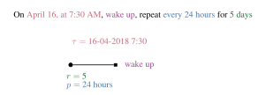
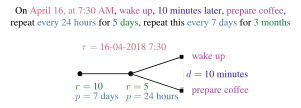

# Mining Periodic Patterns with a MDL Criterion

##### Conference article:
E. Galbrun, P. Cellier, N. Tatti, A. Termier, and B. Crémilleux. *Mining periodic patterns with a MDL criterion.* In the proceedings of the European Conference on Machine Learning and Principles and Practice of Knowledge Discovery in Databases (ECML-PKDD'18), September 2018

## Abstract

The quantity of event logs available is increasing rapidly, be they produced by industrial processes, computing systems, or life tracking, for instance. It is thus important to design effective ways to uncover the information they contain.
Because event logs often record repetitive phenomena, mining periodic patterns is especially relevant when considering such data.
Indeed, capturing such regularities is instrumental in providing condensed representations of the event sequences.

We present an approach for mining periodic patterns from event logs while relying on a Minimum Description Length (MDL) criterion to evaluate candidate patterns. Our goal is to extract a set of patterns that suitably characterises the periodic structure present in the data.
We evaluate the interest of our approach on several real-world event log datasets.

## Periodic patterns

An event log recording daily activities might look like this

Date | Time | Activity
----------------------------
16-04-2018 | 7:30 | wake up 
16-04-2018 | 7:40 | prepare coffee 
&nbsp; | ... | &nbsp;
16-04-2018 | 8:10 | take metro 
&nbsp; | ... | &nbsp;
16-04-2018 | 11:00 | attend meeting 
&nbsp; | ... | &nbsp;
16-04-2018 | 11:00 | eat dinner 
&nbsp; | ... | &nbsp;
17-04-2018 | 7:32 | wake up 
17-04-2018 | 7:38 | prepare coffee 
&nbsp; | ... | &nbsp;
20-04-2018 | 7:28 | wake up 
20-04-2018 | 7:41 | prepare coffee 
&nbsp; | ... | &nbsp;
15-06-2018 | 7:28 | wake up 
&nbsp; | ... | &nbsp; 


A simple periodic pattern of daily activities extracted from this data might look like this...
    


... and a slightly more complex pattern might look like that:
    



## List of contents

- The **data** folder contains the datasets used in the experiments or instruction about how to obtain them.
- The **xps** folder contains the summary of results, a LateX template to produce a report of results, and is meant to receive files produced when running scripts.
- The **scripts** contains the scripts, for mining as well as for parsing results and preparing figures, tables and examples.


## Running the experiments

1. Go to the scripts folder.
2. Mine the real-world datasets:

    ```
    mkdir ../xps/runs
    python run_mine.py vX ##ID##
    ```

    where `##ID##` is replaced by the id of the series to run, chosen among _{bugzilla_0_rel_all, bugzilla_1_rel_all, sacha_18_absI_G1440, sacha_18_absI_G60, 3zap_1_rel, sacha_18_absI_G30, 3zap_0_rel, sacha_18_absI_G15, sacha_18_rel, sacha_18_absI_G1, samba_auth_abs, sacha_18_absI_G720}_ to run one configuration, or among _{UBIQ_ABS, UBIQ_REL, SACHA, ALL}_ to run several at once.

3. Parse the result files to produce the summary file:

    ```
    python xps_parse.py vX
    ```
    
    will create a file called `run_results_vX.csv` in the xps folder.

4. Produce the tables and plots to visualize the results of the real-world sequence experiments:

    ```
    python xps_plot.py vX
    python xps_tables.py vX
    ```

5. Parse results from sacha to turn ids to text and timestamps to date and time:

    ```
    mkdir ../xps/sacha_text
    cp ../xps/runs/sacha*_patts.txt ../xps/sacha_text/
    python xps_examples.py
    ```
    
    for each file `XXX_patts.txt` in the `sacha_text` folder, this will produce a corresponding file `XXX_text-patts.txt` containing the patterns in more readable format

6. Run synthetic experiments:

    ```
    mkdir ../xps/synthe
    python run_synthe.py
    ```

7. Produce boxplots and scatter plots to visualize the results of the synthetic experiments:

    ```
    python xps_synthe_boxplots.py
    python xps_synthe_scatter.py
    ```

8. Compile the latex file to generate a report of the experiments.
